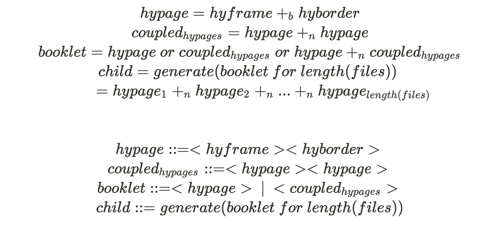

# `leaf`

> An engine (`leaf.engine.ai`) for making beautiful digital booklets.

## Necessity is the Mother of Invention
During 2020 a particular epidemiological constraint encouraged the publications: [region](), [MR](), [LS2](), [AL](https://eoduniyi.github.io/anon-letters/), [DS4_CS]() to each be digital-first publications.

As the computational guide for these projects I was not too fond of the current options for digital booklet making. So, I decided to make another option. Thus, `leaf` was birthed: **to specify and build beautiful digital documents.**

### Overview on form and structure
[Click here](https://storage.googleapis.com/root-proposal-1246/leaf/leaf.engine.mp4) to see video for `leaf.engine()` prototype:

### `ai expressions` for `leaf.engine()`
[Click here](https://storage.googleapis.com/root-proposal-1246/leaf/lecture-1.mp4) to see the definition of a `hyperpage` using `ai expressions`:

_Computing Architect,  
E. Oduniyi_

---

